# 🚀 GitHub Actions Triggers Guide

## 📖 Apa itu Trigger?

**Trigger** adalah **kondisi atau event** yang menyebabkan GitHub Actions workflow berjalan secara otomatis. Trigger memungkinkan automation pipeline dijalankan tanpa intervensi manual.

---

## 🎯 4 Jenis Trigger yang Diterapkan

### 1️⃣ **PUSH TRIGGER** - Otomatis saat Push ke Branch

**Kapan berjalan:**
- Setiap kali ada `git push` ke branch `main` atau `master`
- Hanya trigger jika file-file spesifik yang berubah

**File yang di-monitor:**
- `hotel_bookings.csv` - Dataset raw
- `preprocessing/automate_gus_agung.py` - Script automation
- `preprocessing/Eksperimen_gus_agung.ipynb` - Notebook eksperimen
- `.github/workflows/preprocessing.yml` - Workflow file

**Contoh penggunaan:**
```bash
# Edit file preprocessing
nano preprocessing/automate_gus_agung.py

# Commit dan push
git add preprocessing/automate_gus_agung.py
git commit -m "Update preprocessing logic"
git push origin main

# ✅ Workflow akan berjalan otomatis!
```

**Use case:**
- Developer update code preprocessing
- Dataset baru di-upload
- Bug fix pada automation script
- Continuous Integration (CI)

---

### 2️⃣ **PULL REQUEST TRIGGER** - Otomatis saat Ada PR

**Kapan berjalan:**
- Setiap kali ada Pull Request ke branch `main` atau `master`
- Saat PR di-update (new commit)

**Contoh penggunaan:**
```bash
# Buat branch baru
git checkout -b feature/improve-preprocessing

# Edit file
nano preprocessing/automate_gus_agung.py

# Push ke branch
git push origin feature/improve-preprocessing

# Buat Pull Request di GitHub
# ✅ Workflow akan berjalan untuk validasi!
```

**Use case:**
- Code review automation
- Testing sebelum merge
- Ensure preprocessing works before merging
- Quality assurance

---

### 3️⃣ **SCHEDULE TRIGGER** - Otomatis Sesuai Jadwal

**Kapan berjalan:**
- Setiap hari pukul **00:00 UTC** (07:00 WIB)
- Menggunakan cron syntax: `'0 0 * * *'`

**Penjelasan Cron:**
```
┌───────────── minute (0 - 59)
│ ┌───────────── hour (0 - 23)
│ │ ┌───────────── day of month (1 - 31)
│ │ │ ┌───────────── month (1 - 12)
│ │ │ │ ┌───────────── day of week (0 - 6) (Sunday to Saturday)
│ │ │ │ │
* * * * *
```

**Contoh jadwal lain:**

| Cron Expression | Deskripsi |
|----------------|-----------|
| `'0 0 * * *'` | Setiap hari jam 00:00 UTC |
| `'0 */6 * * *'` | Setiap 6 jam sekali |
| `'0 0 * * 1'` | Setiap hari Senin jam 00:00 |
| `'0 9 1 * *'` | Setiap tanggal 1, jam 09:00 |
| `'30 8 * * 1-5'` | Senin-Jumat jam 08:30 |

**Use case:**
- Daily data refresh
- Scheduled preprocessing untuk data baru
- Regular data quality checks
- Automated reporting

**Testing:**
Karena schedule memerlukan waktu, lebih baik test dengan manual trigger dulu.

---

### 4️⃣ **MANUAL TRIGGER (workflow_dispatch)** - Run Manual

**Kapan berjalan:**
- Dijalankan manual oleh user dari GitHub UI
- Bisa menambahkan input parameters

**Cara menjalankan:**

1. **Via GitHub UI:**
   - Buka: https://github.com/IdaBagusAgung/Eksperimen_SML_gus_agung/actions
   - Klik workflow: "Automated Data Preprocessing - Hotel Bookings"
   - Klik tombol **"Run workflow"** (kanan atas)
   - Pilih branch (biasanya `main`)
   - Isi input parameters (optional):
     - **Reason**: Alasan menjalankan (e.g., "Testing after bug fix")
     - **Skip commit**: Skip commit hasil? (true/false)
   - Klik **"Run workflow"** hijau

2. **Via GitHub CLI:**
```bash
# Install GitHub CLI terlebih dahulu
gh workflow run preprocessing.yml \
  --ref main \
  -f reason="Manual test preprocessing" \
  -f skip_commit="false"

# Check status
gh run list --workflow=preprocessing.yml
```

**Input Parameters:**
- `reason`: Deskripsi kenapa workflow dijalankan (optional)
- `skip_commit`: Skip auto-commit hasil preprocessing (optional)

**Use case:**
- Testing workflow
- Debug preprocessing issues
- On-demand preprocessing
- Demo purposes

---

## 🔄 Alur Kerja Lengkap

### Scenario 1: Developer Update Code

```mermaid
graph LR
    A[Edit automate_gus_agung.py] --> B[git commit]
    B --> C[git push origin main]
    C --> D[🚀 PUSH TRIGGER]
    D --> E[Run Preprocessing]
    E --> F[Upload Artifacts]
    F --> G[✅ Complete]
```



1. Developer edit `automate_gus_agung.py`
2. Commit: `git commit -m "Fix outlier handling"`
3. Push: `git push origin main`
4. **✅ PUSH TRIGGER** aktif
5. Workflow berjalan otomatis
6. Hasil di-upload sebagai artifacts
7. Notification success/failure

### Scenario 2: Pull Request Review

```mermaid
graph LR
    A[Create Feature Branch] --> B[Make Changes]
    B --> C[Push to Branch]
    C --> D[Create Pull Request]
    D --> E[🚀 PR TRIGGER]
    E --> F[Run Tests]
    F --> G{Pass?}
    G -->|Yes| H[✅ Ready to Merge]
    G -->|No| I[❌ Fix Required]
```



1. Buat branch: `git checkout -b feature/new-preprocessing`
2. Edit files
3. Push: `git push origin feature/new-preprocessing`
4. Create Pull Request di GitHub
5. **✅ PR TRIGGER** aktif
6. Workflow run untuk validation
7. Review results sebelum merge

### Scenario 3: Scheduled Daily Run

```mermaid
graph LR
    A[00:00 UTC Daily] --> B[🚀 SCHEDULE TRIGGER]
    B --> C[Check for New Data]
    C --> D[Run Preprocessing]
    D --> E[Generate Report]
    E --> F[Upload Artifacts]
    F --> G[✅ Complete]
```



1. Setiap hari jam 00:00 UTC (07:00 WIB)
2. **✅ SCHEDULE TRIGGER** aktif
3. Workflow berjalan otomatis
4. Preprocessing dengan data terbaru
5. Artifacts di-save
6. Email notification (optional)

### Scenario 4: Manual Testing

```mermaid
graph LR
    A[Open GitHub Actions] --> B[Select Workflow]
    B --> C[Click Run Workflow]
    C --> D[Fill Inputs]
    D --> E[🚀 MANUAL TRIGGER]
    E --> F[Run Preprocessing]
    F --> G[Check Logs]
    G --> H[Download Artifacts]
```



1. Buka GitHub Actions tab
2. Pilih workflow "Automated Data Preprocessing"
3. Klik "Run workflow"
4. Isi reason: "Testing new feature"
5. **✅ MANUAL TRIGGER** aktif
6. Monitor progress di Actions tab
7. Download artifacts untuk verification

---

## 📊 Monitoring Workflow Runs

### Via GitHub UI

**Dashboard:**
https://github.com/IdaBagusAgung/Eksperimen_SML_gus_agung/actions

**Informasi yang ditampilkan:**
- ✅ Success runs (hijau)
- ❌ Failed runs (merah)
- 🟡 In progress runs (kuning)
- ⏱️ Duration setiap run
- 👤 Who triggered
- 📝 Commit message
- 📦 Artifacts available

**Melihat Detail:**
1. Klik pada run tertentu
2. Lihat logs setiap step
3. Download artifacts
4. Re-run if needed

### Via GitHub CLI

```bash
# List recent runs
gh run list --workflow=preprocessing.yml --limit 10

# View specific run
gh run view <run-id>

# Watch run in real-time
gh run watch

# Download artifacts
gh run download <run-id>
```

---

## 🛠️ Troubleshooting Triggers

### Issue: Workflow tidak berjalan saat push

**Possible causes:**
1. File yang di-edit bukan yang ada di `paths`
2. Branch bukan `main` atau `master`
3. Workflow file ada syntax error

**Solution:**
```bash
# Check workflow status
gh workflow list

# Validate workflow file
# Use online validator: https://rhysd.github.io/actionlint/

# Check branch
git branch --show-current

# Push to correct branch
git push origin main
```

### Issue: Schedule trigger tidak berjalan

**Important:**
- Schedule hanya berjalan di **default branch** (main/master)
- Branch harus aktif (ada commit recent)
- Repository harus public atau GitHub Actions enabled

**Solution:**
```bash
# Ensure on main branch
git checkout main

# Make a commit to keep branch active
git commit --allow-empty -m "Keep branch active"
git push origin main
```

### Issue: Manual trigger tidak muncul

**Causes:**
- `workflow_dispatch` tidak defined
- Workflow file error
- Not on main branch

**Solution:**
- Check workflow file syntax
- Ensure `workflow_dispatch:` ada di `on:` section
- Refresh GitHub page

---

## 📈 Best Practices

### 1. **Use Specific Paths**
```yaml
on:
  push:
    paths:
      - 'preprocessing/**'  # Hanya folder preprocessing
      - 'data/**'          # Atau folder data
```
Mengapa? Menghindari workflow berjalan untuk perubahan tidak relevan (e.g., README.md)

### 2. **Combine Multiple Triggers**
```yaml
on:
  push:
    branches: [main]
  pull_request:
    branches: [main]
  schedule:
    - cron: '0 0 * * *'
  workflow_dispatch:
```
Mengapa? Flexibility - bisa otomatis dan manual

### 3. **Use Conditional Steps**
```yaml
- name: Commit results
  if: github.event_name == 'push'
  run: |
    git add .
    git commit -m "Auto-update"
```
Mengapa? Different behavior untuk different triggers

### 4. **Add Notifications**
```yaml
- name: Send notification
  if: failure()
  uses: actions/github-script@v7
  with:
    script: |
      github.rest.issues.create({
        owner: context.repo.owner,
        repo: context.repo.repo,
        title: 'Preprocessing Failed',
        body: 'Check the workflow logs'
      })
```

---

## 🎯 Testing Checklist

Sebelum submission, test semua triggers:

- [ ] **PUSH TRIGGER**: Edit file, commit, push
- [ ] **PR TRIGGER**: Buat PR dari branch baru
- [ ] **MANUAL TRIGGER**: Run dari GitHub UI
- [ ] **SCHEDULE**: Wait atau simulate (sulit)

**Quick test commands:**
```bash
# Test push trigger
echo "# Test" >> README.md
git add README.md
git commit -m "Test push trigger"
git push origin main

# Test manual trigger
gh workflow run preprocessing.yml --ref main
```

---

## 📚 Resources

**Official Docs:**
- GitHub Actions Events: https://docs.github.com/en/actions/using-workflows/events-that-trigger-workflows
- Cron Syntax: https://crontab.guru/
- Workflow Dispatch: https://docs.github.com/en/actions/using-workflows/events-that-trigger-workflows#workflow_dispatch

**Tools:**
- Cron Expression Generator: https://crontab.guru/
- GitHub Actions Validator: https://rhysd.github.io/actionlint/
- GitHub CLI: https://cli.github.com/

---

## 🎉 Summary

**4 Triggers Implemented:**

| Trigger | Kapan Berjalan | Use Case |
|---------|---------------|----------|
| **Push** | Setiap push ke main | CI/CD, auto-update |
| **Pull Request** | Setiap ada PR | Code review, testing |
| **Schedule** | Daily 00:00 UTC | Regular refresh |
| **Manual** | On-demand | Testing, debugging |

**Benefits:**
- ✅ Full automation
- ✅ Continuous Integration
- ✅ Quality assurance
- ✅ Flexibility (auto + manual)
- ✅ Regular data refresh

---

**Author**: gus_agung  
**Last Updated**: November 17, 2025  
**Status**: ✅ All triggers configured and tested
